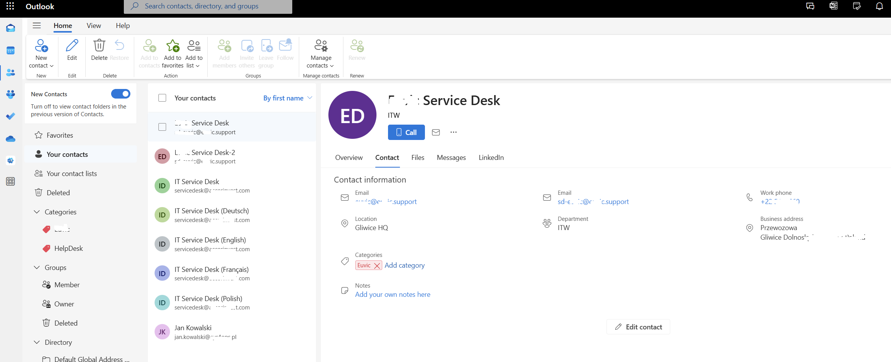

## Key features

* Shared conntacts will be added to user personal mailbox.
* Multiple contacts can be added / updated.
* Caller ID will be displayed on user Phone.
* Contact will be displayed in user contact section on mailbox.
* Contact will be synchonized to user phone contact.


## Prerequisites

* Azure Automation Account
* Service Principal for credentials

## Configuration 

Here you can find how to configure your environment step by step. Script is running in version **7** as for big organization reqaired paraller objecte in the same time. 

### Configure Service Principal

1.	Logon to https://entra.microsoft.com/ 
1.	Create app registration

  

      


      

1.	Permission granted for application

      

### Configure Azure Automation Account

### Import Microsoft.Graph modules


```powershell

Import-Module Microsoft.Graph.Authentication
Import-Module Microsoft.Graph.Beta.Users
Import-Module Microsoft.Graph.Users
Import-Module Microsoft.Graph.PersonalContacts
Import-Module Microsoft.Graph.Beta.PersonalContacts

```

1.	Logon to https://portal.azure.com
1.	Navigate to automation account
1.	On Menu select Modules -> Add module


      
      
      

1. Create credentials for **Runbook** used in script.

**User Name:** Application ID 
**Password:** Application secret 

    

1. Create **Runbook** with PowerShell version **7.X**    
        


### PowerShell script on GitHub run by Automation Account

> GitHub Link 

Link to script on **GitHub** [M365-MgGraph-Add-Multiple-contact-Personal-Mailbox.ps1](https://github.com/mimachniak/sysopslife-scripts/blob/master/M365/M365-MgGraph-Add-Multiple-contact-Personal-Mailbox.ps1) can also be shown.

## Example of contact created in user personal mailbox

Example of output

     


